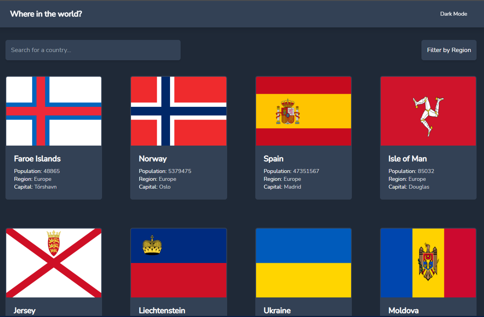
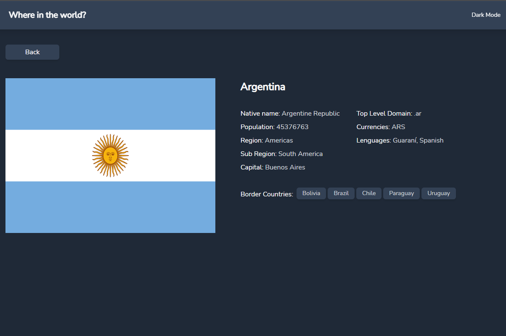

# Disney+ clone

### REST Countries API with color theme switcher Challenge of [Frontend Mentor](https://www.frontendmentor.io/challenges/rest-countries-api-with-color-theme-switcher-5cacc469fec04111f7b848ca)

# Tecnologías utilizadas

* Tailwind CSS
* Typescript
* React { React-Router-Dom }
* Vite

---

---

**[DEMO](https://countries-api-tsx.vercel.app/)**